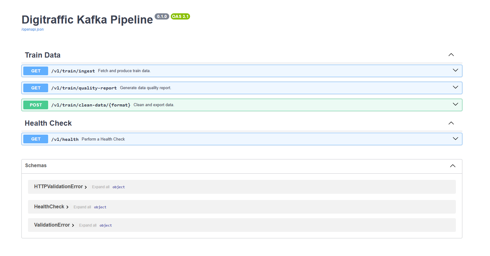

# Digitraffic Kafka Pipeline

## Overview

The Digitraffic Kafka Pipeline is a data processing project designed to fetch train data from the Digitraffic API, standardize it, and publish it to a Kafka topic. Additionally, the application includes functionality to generate data quality reports and export cleaned data in CSV or JSON formats.

## Features

- **Data Ingestion**: Fetch train data from the Digitraffic API and produce it to a Kafka topic.
- **Data Quality Reporting**: Generate reports highlighting data completeness, duplicates, and anomalies.
- **Data Cleaning and Export**: Clean the ingested data and export it to CSV or JSON.
- **Interactive API Documentation**: Explore and test API endpoints via OpenAPI UI available at `/docs`.

## Setup and Run

### 1. Build and Run with Docker Compose

```bash
docker-compose up --build
```

### 2. API Endpoints

Open the browser at `http://localhost/docs` to access the OpenAPI UI.

### 3. Example API Usage

#### Fetch and Produce Train Data

```bash
curl -X GET http://localhost/v1/train/ingest
```

#### Generate Data Quality Report

```bash
curl -X GET http://localhost/v1/train/quality-report
```

#### Export Clean Data as CSV

```bash
curl -X POST http://localhost/v1/train/clean-data/csv --output validated_data.csv
```

#### Perform Health Check

```bash
curl -X GET http://localhost/v1/health
```

## Data Quality Report Example

```json
{
  "status": "success",
  "data_quality_report": {
    "total_records": 527,
    "missing_values": {
      "trainNumber": 0,
      "departureDate": 0,
      "timeTableRows": 0
    },
    "duplicates": 0,
    "anomalies": {
      "departureDate": 0,
      "trainNumber": 0
    }
  }
}
```

## Sample Data

### JSON Example

```json
[
    {
      "trainNumber":7,
      "departureDate":"2024-12-15T00:00:00.000",
      "operatorUICCode":10,
      "operatorShortCode":"vr",
      "trainType":"IC",
      "trainCategory":"Long-distance",
      "commuterLineID":"",
      "runningCurrently":false,
      "cancelled":false,
      "version":290008767183,
      "timetableType":"REGULAR",
      "timetableAcceptanceDate":"2024-10-31T06:14:29.000Z",
      "timeTableRows":[
         {
            "stationShortCode":"HKI",
            "stationUICCode":1,
            "countryCode":"FI",
            "type":"DEPARTURE",
            "trainStopping":true,
            "commercialStop":true,
            "commercialTrack":"9",
            "cancelled":false,
            "scheduledTime":"2024-12-15T13:19:00.000Z",
            "causes":[]
         },
      ]
   }
]
```

### CSV Example

```csv

trainNumber,departureDate,operatorUICCode,operatorShortCode,trainType,trainCategory,commuterLineID,runningCurrently,cancelled,version,timetableType,timetableAcceptanceDate,timeTableRows
7,2024-12-15,10,vr,IC,Long-distance,,False,False,290008767183,REGULAR,2024-10-31 06:14:29+00:00,"[{'stationShortCode': 'HKI', 'stationUICCode': 1, 'countryCode': 'FI', 'type': 'DEPARTURE', 'trainStopping': True, 'commercialStop': True, 'commercialTrack': '9', 'cancelled': False, 'scheduledTime': datetime.datetime(2024, 12, 15, 13, 19, tzinfo=TzInfo(UTC)), 'causes': []}]
```

## OpenAPI UI

The OpenAPI UI, available at `http://localhost/docs`, provides:
- A structured view of all available API endpoints.
- Real-time testing capabilities with curl commands and sample requests/responses.

